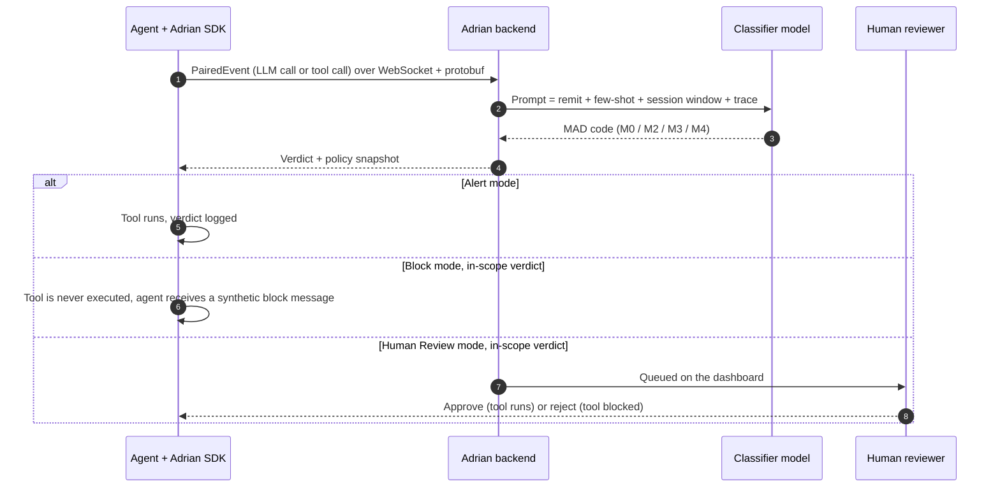
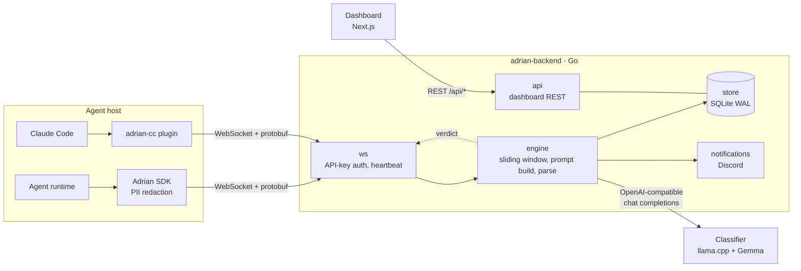

<p align="center">
  <picture>
    <source media="(prefers-color-scheme: dark)" srcset="assets/adrian-logo-dark.png">
    
  </picture>
</p>

<h3 align="center">Runtime security for AI agents.</h3>

<p align="center">
  Adrian watches what your agent <b>does</b> and why it <b>decided</b> to do it,<br>
  then alerts, pauses for a human, or blocks the action before it lands.
</p>

<p align="center">
  <a href="LICENSE"></a>
  <a href="https://pypi.org/project/adrian-sdk/"></a>
  <a href="https://www.npmjs.com/package/@secureagentics/adrian"></a>
  
  
  
  <a href="https://discord.gg/Vq2VyYrw8Z"></a>
  <a href="https://github.com/secureagentics/Adrian/stargazers"></a>
</p>

<p align="center">
  <a href="https://docs.adrian.secureagentics.ai">Documentation</a> ·
  <a href="https://app.adrian.secureagentics.ai">Managed dashboard</a> ·
  <a href="#quickstart">Quickstart</a> ·
  <a href="#self-hosting">Self-hosting</a> ·
  <a href="https://discord.gg/Vq2VyYrw8Z">Discord</a>
</p>

---

## Overview

Adrian is an open-source runtime security monitoring and control engine for AI agents, aligned with the [AARM](https://aarm.dev) specification. It ingests two signals from a running agent, **activity** (tool calls, actions, outputs) and **reasoning** (the chain of thought behind each step), and classifies every step against a declared remit. Depending on policy, a risky step is logged, held for human approval, or stopped before the tool executes.

Static analysis and network monitoring cannot see an agent being talked into misbehaving. Adrian sits inside the agent loop, so it can.

> **Claude Code plugin.** Secure every tool call in your terminal with no code changes:
> `/plugin marketplace add secureagentics/Adrian`, then `/plugin install adrian-cc@adrian`, then `/adrian-init`.
> See [integrations/claude-code](integrations/claude-code/README.md).

<p align="center"><a href="https://www.youtube.com/watch?v=NkEISlRhyFs"><b>Watch the launch video</b></a></p>

## Why Adrian

Most agent monitoring stops at activity logs: API calls, MCP traffic, database queries. Adrian also analyses the agent's reasoning, so it understands why an action was taken, in what context, and what the agent plans to do next. [Research from OpenAI and DeepMind](https://arxiv.org/pdf/2503.11926) reports that combining behaviour and reasoning analysis improves detection accuracy by about 35% and is roughly four times more likely to catch nuanced attacks than behaviour-only monitoring.

|  | Pattern-matching classifiers | Adrian |
|---|---|---|
| **Detection basis** | Similarity to known prompt-injection datasets | Judgement against *your agent's declared remit* |
| **Signals** | Prompt or output text | Reasoning traces, tool calls and tool outputs, correlated across the whole session |
| **Novel attacks** | Only what the training set has seen | An e-commerce agent that starts resetting passwords is flagged even though no dataset contains it |
| **Response** | Score or log | Alert, human review, or in-flight block, set per agent |

## What it detects

Every classified step receives a MAD (Malicious Activity Detection) code. Codes map to the OWASP Top 10 for LLM Applications and the OWASP Top 10 for Agentic Applications.

| Tier | Meaning | Sub-categories | Default action |
|---|---|---|---|
| **M0** | Benign and within remit | n/a | None |
| **M2** | Likely misuse | Scope overreach · indirect policy evasion · unverified tool use · following injected or user instructions over policy · concealment · dispatch without constraint check · accepting physically implausible data | Notify |
| **M3** | High-risk misuse | Safeguard bypass · assistance in a cyber attack · data exfiltration intent · privilege escalation · deceptive behaviour · active exploitation or injection compliance | Block |
| **M4** | Maximum severity | Serious privacy breach or theft · backdoor or persistent compromise · alignment circumvention · destructive action · automated abuse | Escalate |

In practice this covers direct and indirect prompt injection, jailbreaks, tool poisoning, unsafe or off-policy tool calls, secret and credential leakage, and out-of-remit behaviour.

## How it works



1. **Instrument.** The SDK hooks your framework and pairs each `*_start` / `*_end` callback into a single `PairedEvent` carrying agent identity, parent context and payload.
2. **Redact.** PII is scrubbed on the client before anything leaves the process.
3. **Classify.** The backend keeps a sliding window of recent turns per `(session, invocation, agent)` so multi-step attacks are judged in context, and asks the classifier for a single MAD code.
4. **Enforce.** The verdict returns to the SDK together with the policy in force. In Block and Human Review modes the SDK holds each `ToolNode` call until the verdict for the LLM turn that requested it arrives, correlated by `tool_call.id`.

Tool-side attacks are covered on the next turn: a benign-looking call whose *output* carries an injection is caught when the poisoned output reaches the following LLM step, before the follow-up tool runs.

### Execution modes

The mode is configured per agent in the dashboard and pushed to the SDK on connect. There is no client-side switch to tamper with.

| Mode | Behaviour |
|---|---|
| **Alert** | Never interferes. Verdicts are logged and optionally notified. |
| **Block** | In-scope verdicts stop the tool call; the agent receives a synthetic `[BLOCKED by security policy]` result and the real tool never runs. |
| **Human Review** | In-scope verdicts pause the tool call until a person approves or rejects it on the dashboard. Out-of-scope verdicts pass straight through. |

Which tiers are "in scope" is controlled by per-agent toggles (`M0`, `M2`, `M3`, `M4`). The defaults arm M3 and M4.

## Quickstart

The fastest route is the managed dashboard. To run everything on your own hardware, go to [Self-hosting](#self-hosting).

**Prefer a hands-off install?** Give your coding agent [GET_STARTED_AI_GUIDE.md](GET_STARTED_AI_GUIDE.md) (also available as a [video walkthrough](https://youtu.be/7vYjeGxY8to)). It keeps secrets in a local `.env` and never asks you to paste a key into chat. As with any instructions you hand to an agent, read it first.

1. Sign up at [app.adrian.secureagentics.ai](https://app.adrian.secureagentics.ai) and create an API key.
2. In the dashboard, describe your agent's remit and choose a mode and alert channels.
3. Install the SDK and your model provider:

   ```sh
   pip install adrian-sdk langchain langchain-openai   # or langchain-anthropic, etc.
   ```

4. Bracket your existing code with `init` and `shutdown`:

   ```python
   import asyncio
   import adrian
   from langchain_openai import ChatOpenAI

   async def main():
       adrian.init(
           api_key="adr_live_...",
           ws_url="wss://adrian.secureagentics.ai/ws",  # omit when self-hosting locally
       )
       llm = ChatOpenAI(model="gpt-4o")
       response = await llm.ainvoke(
           "Find the most underpriced recent IPOs and build an investment strategy"
       )
       print(response.content)
       adrian.shutdown()

   asyncio.run(main())
   ```

5. Run the agent. Events appear in the dashboard within seconds, classified by severity.

> Use the async pattern. The WebSocket transport runs on the asyncio loop, so a synchronous `llm.invoke` can return before events are flushed.

More runnable examples live in [`examples/python`](examples/python) (LangChain agents, Anthropic, streaming, manual instrumentation, human-review gating) and [`examples/typescript`](examples/typescript).

## Self-hosting

Adrian can run fully offline on a single host with no managed cloud and no telemetry leaving the machine. The stack is the Go backend (WebSocket ingest, dashboard API, classification engine), the Next.js dashboard, and a `llama.cpp` container serving a local Gemma model.

**Requirements**

- Docker with Compose v2
- An NVIDIA GPU with a recent CUDA driver and the [NVIDIA Container Toolkit](https://docs.nvidia.com/datacenter/cloud-native/container-toolkit/latest/install-guide.html)
- About 10 GB of free disk for the model

The default classifier is Gemma 4 (E4B at roughly 5 GB, or E2B at roughly 3 GB), tested on NVIDIA GPUs. CPU-only operation is possible but slow at these model sizes.

**Bring-up**

```sh
git clone https://github.com/secureagentics/Adrian
cd Adrian

# 1. Bootstrap: creates the SQLite DB, applies migrations, generates an admin
#    password and session secret, writes .env, and offers to download a model.
docker compose --profile setup run --rm setup bootstrap
#    Already have a GGUF in ./models/?  Add:  --gguf my-model.gguf

# 2. Start backend, dashboard and classifier.
docker compose --profile llm up -d
```

Open `http://localhost:3000` and sign in as `admin@localhost` with the password printed by bootstrap (you will be asked to change it). Create an SDK key under **Settings → Agents → New key**.

Then install the in-tree SDK and point it at your backend. It defaults to `ws://localhost:8080/ws`, so only the key is needed:

```sh
make sdk-install
source .venv/bin/activate
uv pip install "langchain>=1.0,<2.0" "langchain-openai>=1.0,<2.0"
```

Admin tasks run through the same setup container:

```sh
docker compose --profile setup run --rm setup reset-password
docker compose --profile setup run --rm setup set-model --gguf gemma-4-e4b.gguf
```

See the [backend reference](https://docs.adrian.secureagentics.ai/reference/backend) for more.

## Architecture



| Component | Path | Stack | Role |
|---|---|---|---|
| Backend | [`backend/`](backend) | Go 1.25, SQLite (WAL) | WebSocket ingest, classification engine, policy, human-review queue, audit log, dashboard API |
| Dashboard | [`frontend/`](frontend) | Next.js 15, React 19, Tailwind | Agents and keys, policy editor, event and verdict feeds, review queue, webhooks, MCP servers |
| Python SDK | [`sdk/python/`](sdk/python) | Python 3.12+ | LangChain, LangGraph and Anthropic instrumentation |
| TypeScript SDK | [`sdk/typescript/`](sdk/typescript) | Node 18+, npm workspaces | Core pipeline and OpenAI client wrapper |
| Claude Code plugin | [`integrations/claude-code/`](integrations/claude-code) | Python 3.12+, vendored deps | Hook-based enforcement inside Claude Code |
| Wire format | [`proto/event.proto`](proto/event.proto) | Protobuf | Shared contract between SDKs and backend |

The full container and package breakdown is in [docs/ARCHITECTURE.md](docs/ARCHITECTURE.md).

## SDKs and integrations

| Target | Package | Install |
|---|---|---|
| LangChain / LangGraph (Python) | [`adrian-sdk`](sdk/python/README.md) | `pip install adrian-sdk` |
| Anthropic SDK (Python) | [`adrian-sdk[anthropic]`](sdk/python/ANTHROPIC.md) | `pip install "adrian-sdk[anthropic]"` |
| TypeScript core | [`@secureagentics/adrian`](sdk/typescript/README.md) | `npm install @secureagentics/adrian` |
| OpenAI SDK (TypeScript) | [`@secureagentics/adrian-openai`](sdk/typescript/packages/openai/README.md) | `npm install @secureagentics/adrian-openai openai` |
| Claude Code | [`adrian-cc`](integrations/claude-code/README.md) | `/plugin install adrian-cc@adrian` |

The LangChain integration supports multi-agent topologies (subagents as tools, handoffs, hierarchical and supervisor graphs, parallel fan-out, swarms) and records parent and child relationships so a delegated agent is judged in the context of the agent that spawned it.

Alerting from the bundled backend goes to Discord webhooks. CrewAI and further alert channels are on the roadmap; the [integrations page](https://docs.adrian.secureagentics.ai/integrations) tracks the current list.

### Claude Code plugin

```text
/plugin marketplace add secureagentics/Adrian
/plugin install adrian-cc@adrian
/adrian-init
```

`/adrian-init` lets you choose Adrian Cloud, a self-hosted backend or a custom URL, writes `~/.adrian/.env`, and verifies the connection. After that, every tool call is classified and handled according to the server-side mode:

- **Alert** logs only.
- **Block** denies in-scope high-risk calls before they run.
- **Human Review** asks you to approve or deny inline in the terminal.

It also tracks sub-agents with parent and child hierarchy, captures tool output, groups events by prompt, and parses Claude's reasoning from the transcript. Requires Python 3.12+ on your `PATH`; dependencies are vendored, so there is no pip step.

## Security and privacy by design

- **PII redaction on the client.** Redaction is always on with no opt-out. Emails, phone numbers, SSNs, Luhn-validated card numbers, private IPs, dates of birth, IBANs, passports, street addresses, postal codes, driver licences and AWS access keys are replaced with tags such as `[EMAIL_REDACTED]` before an event is serialised, so the classifier sees the shape of the text but not the values.
- **Server-driven enforcement.** Mode and scope come from the backend policy, not from client flags.
- **Data sovereignty.** The self-hosted stack makes no outbound calls; classification runs on a local model.
- **Explicit failure policy.** If the backend or classifier is unreachable, behaviour is configurable. The SDKs fail open by default after a timeout (`ADRIAN_BLOCK_TIMEOUT`, 30 s) and the Claude Code plugin fails open unless `ADRIAN_CC_FAIL_OPEN=false`. The backend policy exposes `fail_closed_on_classifier_error`, which is off by default. Choose deliberately for high-stakes agents.
- **Hardened containers.** The backend ships as a static binary in a distroless image, images are build-only (`pull_policy: build`), and the classifier port is bound to `127.0.0.1`.
- **Audit trail.** Events, verdicts, review decisions and administrative actions are persisted and viewable in the dashboard.

Human Review waits are held in the SDK process. If the SDK restarts before a pending review is resolved, the late decision is dropped; the audit record survives.

To report a vulnerability, follow [SECURITY.md](SECURITY.md). Please do not open a public issue.

## Configuration

Self-hosted settings live in `.env`, generated by `bootstrap` (see [`.env.example`](.env.example)).

| Variable | Default | Purpose |
|---|---|---|
| `ADRIAN_LLM_URL` | bundled `llama.cpp` endpoint | Classifier chat-completions URL, called verbatim |
| `ADRIAN_LLM_MODEL_PATH` | set by bootstrap | In-container path of the GGUF model |
| `ADRIAN_LLM_CTX_SIZE` | `8192` | Classifier context window (higher uses more VRAM) |
| `ADRIAN_SLIDING_WINDOW_SIZE` | `16` | Recent turns kept per session, invocation and agent |
| `ADRIAN_SLIDING_WINDOW_TTL_SECONDS` | `86400` | Window retention |
| `ADRIAN_BACKEND_PORT` / `ADRIAN_DASHBOARD_PORT` | `8080` / `3000` | Host-side ports |
| `ADRIAN_SESSION_SECRET` | generated | Dashboard session cookie secret; never commit |

SDK-side variables (`ADRIAN_API_KEY`, `ADRIAN_WS_URL`, `ADRIAN_SESSION_ID`, `ADRIAN_BLOCK_TIMEOUT`) are documented in each SDK README.

## Repository layout

```text
.
├── backend/              Go service: ws, engine, store, api, notifications, alerts
├── frontend/             Next.js dashboard
├── sdk/
│   ├── python/           adrian-sdk (LangChain, LangGraph, Anthropic)
│   └── typescript/       @secureagentics/adrian and @secureagentics/adrian-openai
├── integrations/
│   └── claude-code/      adrian-cc plugin, hooks and slash commands
├── proto/                Wire protocol (protobuf)
├── examples/             Runnable Python and TypeScript examples
├── deploy/               Dockerfiles for backend, frontend and setup
├── docs/                 Architecture notes
├── scripts/              Bootstrap and licence-header tooling
└── compose.yaml          Single-host orchestration (profiles: setup, llm)
```

## Development

```sh
make sdk-install          # .venv + editable Python SDK with dev dependencies (needs uv)
make sdk-test             # Python SDK test suite
pre-commit install        # ruff, basedpyright, licence headers, whitespace checks

cd sdk/typescript && npm install && npm run build && npm test
cd backend && go test ./...
```

CI lints the Python SDK on pull requests and builds, tests and releases both SDKs. Read [CONTRIBUTING.md](CONTRIBUTING.md) before opening a pull request.

## Contributing

Contributions are welcome. In short: sign the [CLA](CLA.md), branch from `main`, keep one logical change per pull request, follow the [PR template](.github/PULL_REQUEST_TEMPLATE.md), and add the [SPDX header](LICENSE_HEADER.txt) to new source files. Prose uses British English and avoids em-dashes. See [CONTRIBUTORS.md](CONTRIBUTORS.md) for the people who have shaped the project.

## Community

- [Discord](https://discord.gg/Vq2VyYrw8Z) for questions and discussion with the team and other users
- [LinkedIn](https://www.linkedin.com/company/secure-agentics) for product updates
- [Issues](https://github.com/secureagentics/Adrian/issues) for bugs and feature requests

If you think agents need a runtime security layer, a ⭐ helps other people find the project.

## Licence

Released under the [Apache License 2.0](LICENSE). © SecureAgentics.

<p align="center"><sub>Adrian is built by <a href="https://www.secureagentics.ai">Secure Agentics</a>.</sub></p>
